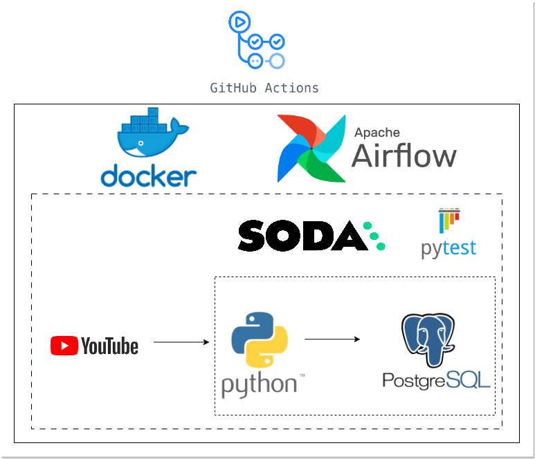
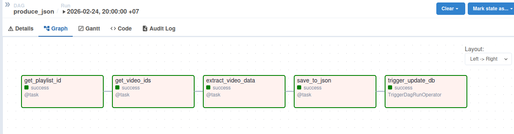
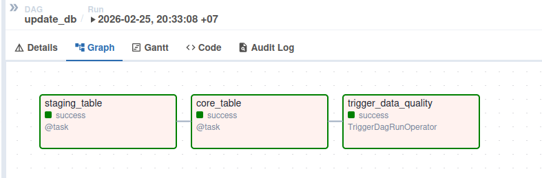
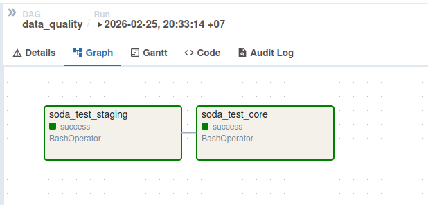
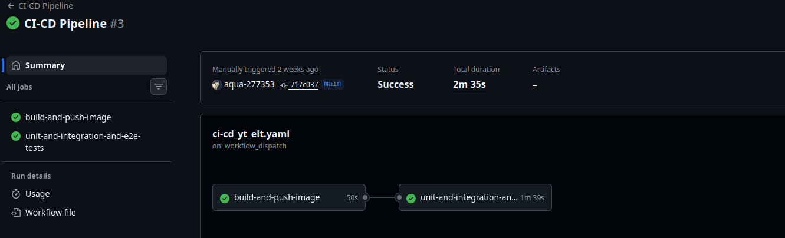
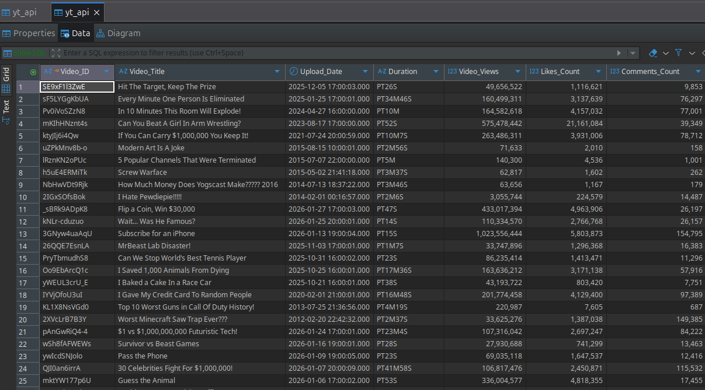
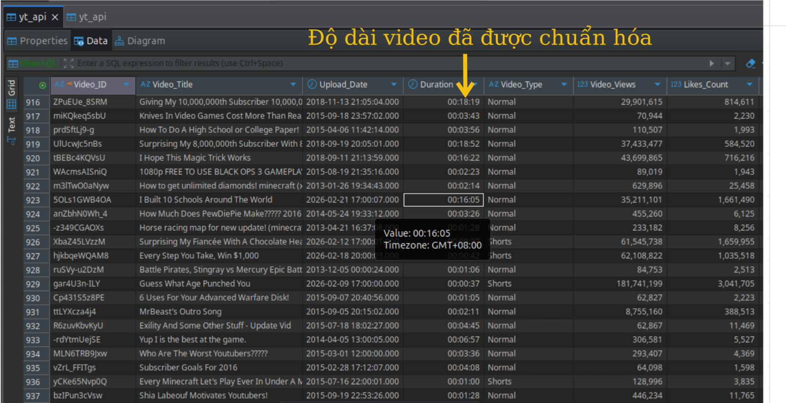

# 🚀 YouTube API ELT Pipeline  

---

## 1. Tổng quan dự án

Đây là một **production-style ELT Data Pipeline** mô phỏng hệ thống thu thập và quản lý dữ liệu phân tích từ YouTube API. Mục tiêu tập trung vào:

- Thiết kế **scalable ELT architecture**
- Xây dựng pipeline có **data quality validation**
- Triển khai **containerized orchestration**
- Áp dụng **CI/CD cho data workflow**
- Đảm bảo tính **idempotent & incremental loading**

---

## 2. Architecture Overview

<p align="center">
  
</p>

Pipeline tuân theo mô hình **ELT (Extract → Load → Transform)**.

### Data Flow

1. Extract dữ liệu từ YouTube API bằng Python
2. Load raw data vào `staging schema`
3. Transform và upsert vào `core schema`
4. Validate bằng Data Quality checks
5. Sẵn sàng cho BI/Analytics layer

Thiết kế gồm:

- Containerized Airflow (Docker)
- PostgreSQL (staging + core layer)
- Modular DAG orchestration
- CI/CD với GitHub Actions

---

## 3. Engineering Decisions

### 🔹 Vì sao dùng ELT thay vì ETL?

- Vì chi phí lưu trữ hiện tại đã rất rẻ nên có thể  nên có thể thực hiện Load trước mà không sợ làm lãng phí không gian lưu trữ.


### 🔹 Vì sao tách staging & core schema?

| Layer     | Mục đích |
|-----------|----------|
| staging   | Lưu raw data, phục vụ audit/debug |
| core      | Chuẩn hóa, clean data, sẵn sàng analytics |

Thiết kế này giúp:
- Tránh làm hỏng raw data
- Dễ reprocess
- Chuẩn mô hình Data Warehouse

### 🔹 Upsert Strategy

Được xử lý bằng logic code Python thông qua cấu trúc điều kiện if-else khi lặp qua từng dòng dữ liệu. Script sẽ trích xuất tất cả ID đang có trong bảng thành một list/set và đối chiếu:
- Nếu ID của video mới chưa tồn tại trong danh sách ID của bảng thì thực hiện hành động insert.
- Ngược lại, nếu ID đã tồn tại thì thực hiện hàm update để cập nhật các giá trị có thể thay đổi như lượt xem, lượt thích, và bình luận

---

## 4. Extracted Fields

Lần gọi API đầu tiên sẽ nạp dữ liệu vào hệ thống - đây là bước **full upload** ban đầu.

Các lần lấy dữ liệu tiếp theo sẽ thực hiện **upserts** (cập nhật hoặc chèn mới) giá trị cho một số variables (cột) nhất định. Một khi core schema đã được nạp đủ dữ liệu và các bước unit test cùng data quality tests được triển khai thành công, dữ liệu sẽ ở trạng thái sẵn sàng để phân tích.

7 variables sau đây được trích xuất từ API:

- *Video ID*  
- *Video Title*  
- *Upload Date*  
- *Duration*  
- *Video Views*  
- *Likes Count*  
- *Comments Count*

---

## 5. Orchestration – Apache Airflow

Pipeline gồm 3 DAG chính:

### 1️⃣ `produce_json`
- Extract dữ liệu từ YouTube API
- Lưu raw JSON file

### 2️⃣ `update_db`
- Parse JSON
- Load vào staging
- Transform & upsert sang core

### 3️⃣ `data_quality`
- Kiểm tra:
  - Null values
  - Duplicate primary key
  - Negative metrics
  - Schema validation

DAG được thiết kế theo dependency chain (TriggerDagRunOperator) đảm bảo thứ tự thực thi đúng.

---

## 6. Data Quality & Testing

### 🔹 Unit Testing – `pytest`
- Test API extraction logic
- Test transformation functions
- Mock API response

### 🔹 Data Quality – `SODA Core`

- No duplicate `video_id`
- No NULL in required columns
- Metrics >= 0
- Record count validation

---

## 7. CI/CD – GitHub Actions

Pipeline được tích hợp CI/CD để:

- Build Docker image tự động
- Push image lên Docker Hub
- Validate DAGs
- Run unit tests
- Kiểm tra integrity trước khi deploy

Mục tiêu:
> Đảm bảo mọi thay đổi đều không phá vỡ pipeline.

---

## 8. Containerization Strategy

Sử dụng:

- Docker
- Docker Compose
- Custom Airflow image (Dockerfile)

Environment Variables:
- AIRFLOW_CONN_{CONN_ID}
- AIRFLOW_VAR_{VARIABLE_NAME}


Fernet Key được dùng để mã hóa credentials.

Thiết kế container hóa giúp:

- Reproducibility
- Portable deployment
- Tách biệt môi trường local vs production

---

## 9. Results & Performance

- Incremental load hoạt động chính xác (zero duplicate rows)
- Full load ingest toàn bộ video lịch sử
- DAG runtime: 1 phút cho 947 video
- Pipeline có thể tái sử dụng cho bất kỳ YouTube channel nào chỉ bằng cách thay Channel ID

---

## 10. Project Showroom

- Airflow DAGs
<p align="center">
  
</p>
<p align="center">
  
</p>
<p align="center">
  
</p>

- Quy trình CI/CD
<p align="center">
  
</p>

- Dữ liệu staging schema
<p align="center">
  
</p>

- Dữ liệu core schema
<p align="center">
  
</p>

---

## 11. How To Run Locally

### 1️⃣ Clone repository
git clone https://github.com/aqua-277353/Youtube_ETL.git
cd Youtube_ELT

### 2️⃣ Tạo file `.env`

```bash
# DockerHub image
DOCKERHUB_NAMESPACE=aqua-277353
DOCKERHUB_REPOSITORY=yt_api_elt
IMAGE_TAG=latest

# Postgres connection
POSTGRES_CONN_USERNAME=postgres
POSTGRES_CONN_PASSWORD=your_postgres_password
POSTGRES_CONN_HOST=postgres
POSTGRES_CONN_PORT=5432

# Metadata database credentials
METADATA_DATABASE_NAME=airflow_metadata_db
METADATA_DATABASE_USERNAME=airflow_meta_user
METADATA_DATABASE_PASSWORD=your_meta_db_password

# Celery database credentials
CELERY_BACKEND_NAME=celery_results_db
CELERY_BACKEND_USERNAME=celery_user
CELERY_BACKEND_PASSWORD=your_celery_password

# ELT database credentials
ELT_DATABASE_NAME=elt_db
ELT_DATABASE_USERNAME=yt_api_user
ELT_DATABASE_PASSWORD=your_elt_db_password

# Airflow params 
AIRFLOW_UID=1000
AIRFLOW_WWW_USER_USERNAME=airflow
AIRFLOW_WWW_USER_PASSWORD=airflow1234
FERNET_KEY=your_generated_fernet_key_here

# Youtube params
API_KEY="YOUR_YOUTUBE_API_KEY_HERE"
CHANNEL_HANDLE="MrBeast"
```

### 3️⃣ Build & Run
docker compose up --build


### 4️⃣ Truy cập Airflow UI
http://localhost:8080/


---

## 12. Tech Stack

**Languages** : Python, SQL
**Orchestration**:  Apache Airflow
**Data Storage**: PostgreSQL
**Containerization**: Docker, Docker Compose
**Testing**: pytest, SODA Core
**CI/CD**: GitHub Actions


